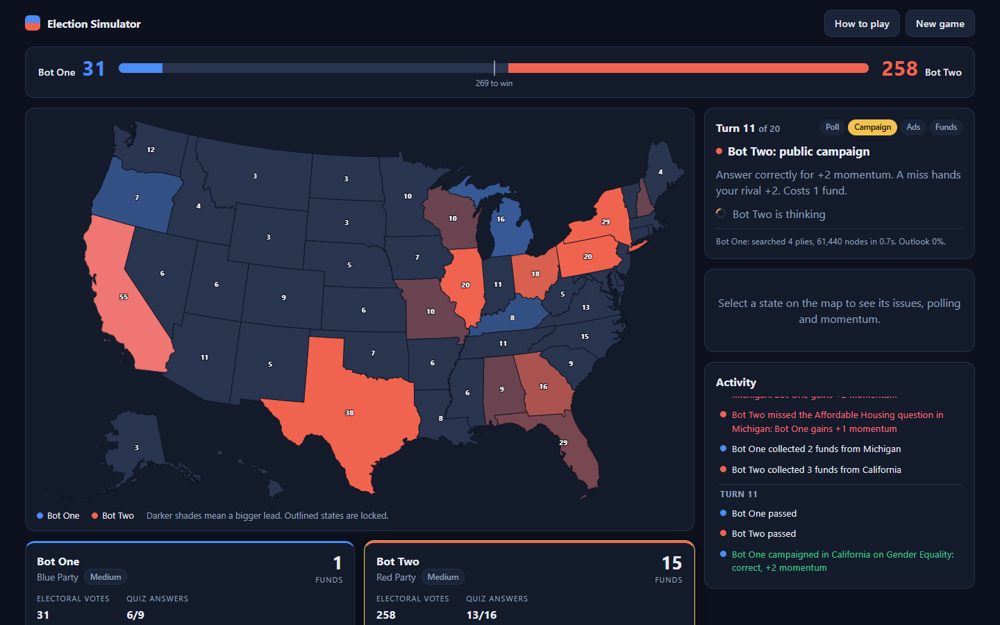
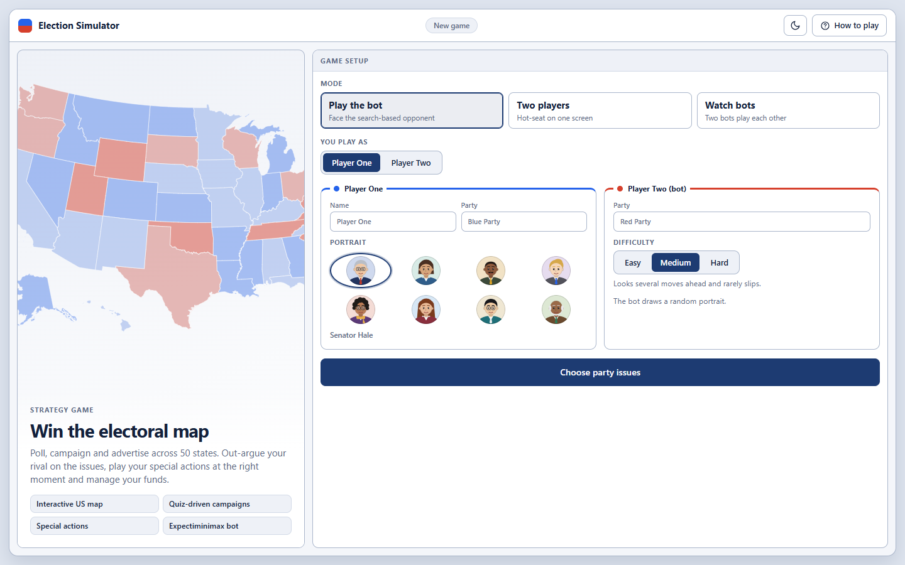
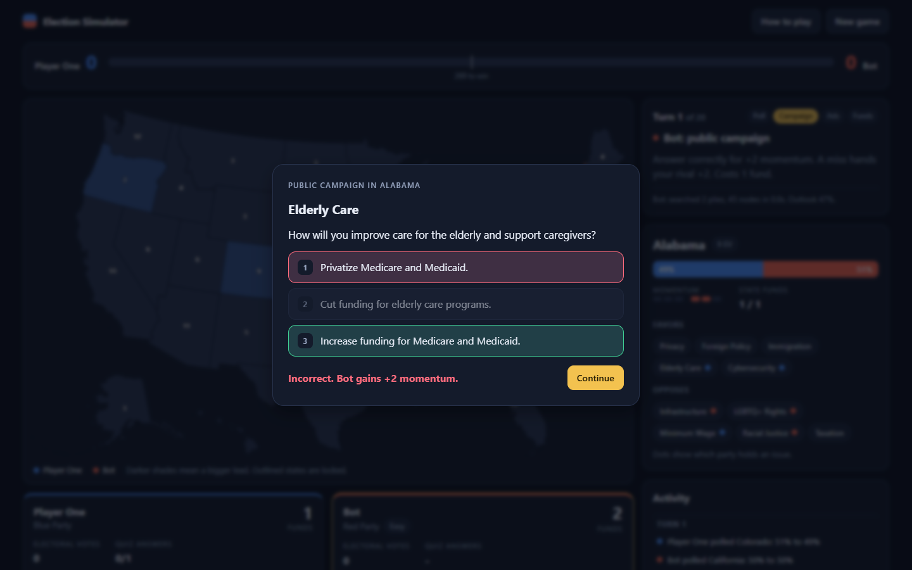

# Election Simulator

A two-player election strategy game played on an interactive map of the United States. Poll, campaign and advertise across 50 states, answer issue questions to build momentum, and win more of the 536 electoral votes than your rival. Play head to head, or against a bot that searches the game tree with expectiminimax and adapts to how you answer.

**Live demo:** [election-simulator-iota.vercel.app](https://election-simulator-iota.vercel.app)



## Features

- **Interactive US map.** Click any state to inspect its polling split, momentum, funds and the issues it favors and opposes. Colors show who leads and by how much, and locked states are outlined.
- **Three ways to play.** Against the bot as either seat, two players on one screen, or watch two bots play each other.
- **A real opponent.** The bot runs in a Web Worker, so the interface never freezes while it thinks. Three difficulty levels trade search depth, thinking time and quiz accuracy.
- **Opponent modelling.** The bot tracks how often you answer questions correctly and plans around that estimate.
- **Responsive and accessible.** Works on phones, follows the system light or dark theme, and the whole map is keyboard navigable.

| Setup | Campaign quiz |
| --- | --- |
|  |  |

## How the game works

- A game lasts 20 turns. Each turn has three phases (poll, public campaign, advertisement) in which Player One acts and then Player Two, followed by a funding phase.
- Every poll or campaign costs 1 fund. Each player starts with 3 funds and collects more from states they lead.
- **Polling** resets a state's split to roughly 50-50.
- **Campaigning** needs an issue you can use: an issue a state favors that your party holds, or an issue a state opposes that your rival holds. Answer the quiz correctly to gain momentum, and a miss hands it to your rival. A public campaign swings momentum by 2, advertising by 1.
- At the end of each turn momentum moves a state's split by 5 points towards the player with more of it. A state locks once a player reaches 100%.
- After the last turn every open state goes to the player with more momentum there, and the player with more electoral votes wins.

## The bot

The bot picks moves with **expectiminimax**: minimax over the two players' choices, with chance nodes for the quiz answers.

| Technique | What it does |
| --- | --- |
| Alpha-beta pruning | Skips branches that cannot change the decision. Chance nodes use Star1 bounds so pruning still works across quiz outcomes. |
| Iterative deepening | Searches one ply deeper at a time under a time budget and always keeps the last completed result. |
| Move ordering and beam | Ranks moves with a cheap expected-gain estimate, searches the best first and keeps only the top few below the root. |
| Forced-move extension | Turns where the only legal move is to pass cost no search depth. |
| Evaluation | Estimates the expected electoral-vote margin from momentum, percentage leads, lock progress, and the value of funds. The estimate sharpens towards the exact end-of-game rule as turns run out. |
| Opponent model | Learns your quiz accuracy with a Bayesian estimate and feeds it into the chance nodes. |

Difficulty levels:

| Level | Thinking time | Max depth | Quiz accuracy | Random slips |
| --- | --- | --- | --- | --- |
| Easy | 0.15 s | 2 plies | 55% | 30% |
| Medium | 0.7 s | 5 plies | 75% | 10% |
| Hard | 2 s | 9 plies | 95% | none |

The pruned search is tested against a brute-force expectiminimax with the same ordering and beam, and it returns identical values. `npm run benchmark` plays the bot against a random player and a one-ply greedy player.

Measured with `npm run benchmark -- 30 50 7` (50 ms per move, 30 games each, seats alternating, all players answering 80% of questions correctly):

| Opponent | Bot wins | Average margin |
| --- | --- | --- |
| Random player | 30 / 30 | +390 electoral votes |
| One-ply greedy player | 22 / 30 | +168 electoral votes |

Longer thinking time plays stronger: in earlier runs the bot beat the greedy player in 24 of 40 games at 20 ms per move and 31 of 40 at 100 ms.

## Getting started

Requires Node.js 20.19 or newer.

```bash
npm install
npm run dev        # start the dev server
npm test           # engine and search tests
npm run build      # typecheck and production build
npm run benchmark -- 30 100   # games, milliseconds per move
```

## Project structure

```
src/
  engine/        Rules, evaluation, search and the headless runner (no UI dependencies)
    data/        The 20 issues with their quizzes and the 50 states
  ai/            Web Worker that runs the search off the main thread
  game/          Game session: turn loop, quizzes, bot scheduling
  components/    React components
  map/           Projected US state geometry
console/         C++ console version of the game, split into modules
scripts/         Benchmark script
```

## Console edition

The original C++ version lives in [`console/`](console), split into small modules: game model and rules (`model`), evaluation (`evaluate`), search (`search`), agents (`human_agent`, `bot_agents`), the console flow (`game`, `console_io`) and the data tables (`issues`, `states`). It uses the same search approach.

```bash
g++ -std=c++14 -O2 console/*.cpp -o election-simulator
./election-simulator
./election-simulator --benchmark 20 100   # games, milliseconds per move
```

## Notes

- Player Two answers each move within a phase after seeing Player One's, which gives it a measurable edge between evenly matched players. The seat selector lets you choose either side.
- Map geometry comes from [us-atlas](https://github.com/topojson/us-atlas), rendered with d3-geo.

## Built with

React, TypeScript, Vite, d3-geo, topojson-client and Vitest.
