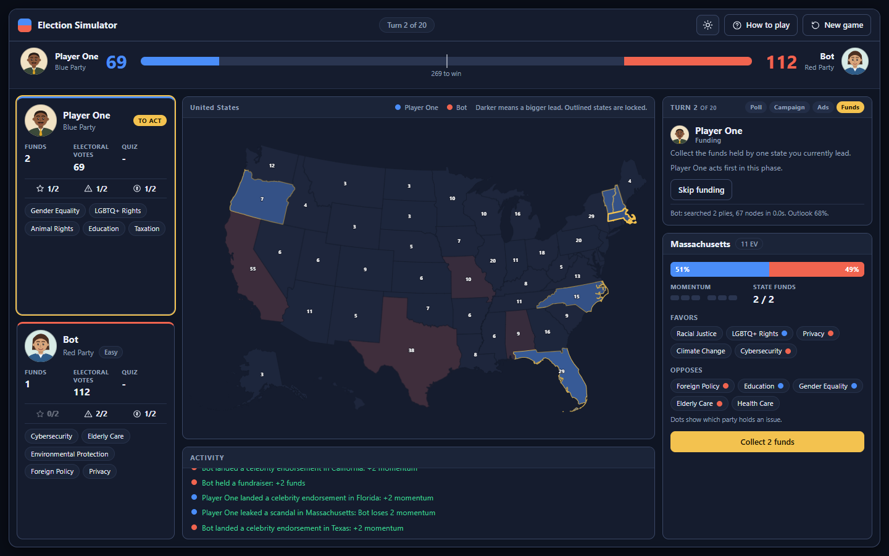
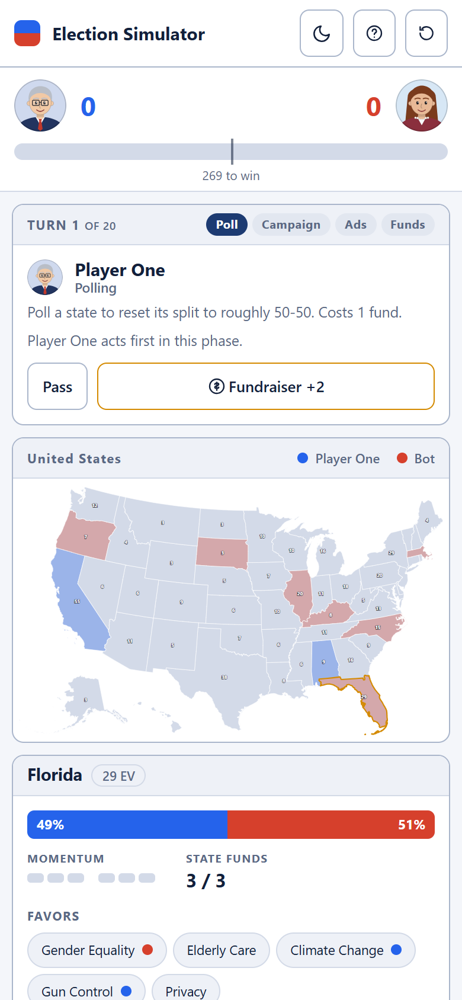

# Election Simulator

A two-player election strategy game played on an interactive map of the United States. Poll, campaign and advertise across 50 states, answer issue questions to build momentum, play celebrity endorsements and scandal leaks at the right moment, and win more of the 536 electoral votes than your rival. Play head to head, or against a bot that searches the game tree with expectiminimax and adapts to how you answer.

**Live demo:** [election-simulator-iota.vercel.app](https://election-simulator-iota.vercel.app)


## Features

- **Interactive US map.** Click any state to inspect its polling split, momentum, funds and the issues it favors and opposes. Colors show who leads and by how much, and locked states are outlined.
- **Special actions.** Celebrity endorsements, scandal leaks and fundraisers add risk and timing to every turn. Both players get the same limited supply.
- **Fair turn order.** Who acts first alternates every phase and a coin toss decides the opening, so neither side keeps the last word.
- **Three ways to play.** Against the bot as either seat, two players on one screen, or watch two bots play each other.
- **A real opponent.** The bot runs in a Web Worker, so the interface never freezes while it thinks. Three difficulty levels trade search depth, thinking time and quiz accuracy. It follows the same rules and limits as you.
- **Opponent modelling.** The bot tracks how often you answer questions correctly and plans around that estimate.
- **Cartoon politicians.** Pick a portrait for your candidate from eight original characters. The bot draws a random one that you did not take.
- **Light and dark themes.** Light by default with a toggle that remembers your choice.
- **Desktop and mobile.** On a desktop the game fills a fixed window with no page scrolling. On tablets and phones it switches to a single scrolling column with the controls next to the map. The whole map is keyboard navigable.

| Setup | Campaign quiz |
| --- | --- |
|  |  |

| Dark theme | Mobile |
| --- | --- |
|  |  |

## How the game works

- A game lasts 20 turns. Each turn has three phases (poll, public campaign, advertisement) followed by a funding phase.
- Every poll or campaign costs 1 fund. Each player starts with 3 funds and collects more from states they lead.
- **Polling** resets a state's split to roughly 50-50.
- **Campaigning** needs an issue you can use: an issue a state favors that your party holds, or an issue a state opposes that your rival holds. Answer the quiz correctly to gain momentum, and a miss hands it to your rival. A public campaign swings momentum by 2, advertising by 1.
- **Special actions** replace your normal action in a poll, campaign or advertising phase, and each player gets two of each:
  - *Celebrity endorsement* (2 funds): certain +2 momentum in any state, with no quiz and no issue match needed.
  - *Scandal leak* (1 fund): a 60% chance to drain 2 of your rival's momentum in a state, otherwise it backfires and you lose 2 of yours.
  - *Fundraiser* (free): +2 funds.
- At the end of each turn momentum moves a state's split by 5 points towards the player with more of it. A state locks once a player reaches 100%.
- After the last turn every open state goes to the player leading its polling split, with momentum as the tiebreak. The player with more electoral votes wins, and a tie goes to Player Two.

### Why the order alternates

If one player always acts first in a phase, the other always gets the last reply, and a single correct answer at the end can wipe out the momentum the first player built. Measured between equally skilled players, the one who acted first won only 34% of games with greedy bots and 32% with search bots.

Two rules remove that edge. Who acts first alternates every phase, with a coin toss for the opening order, and open states at the end go to the polling leader rather than to whoever holds momentum, so a late swing cannot erase support built over many turns.

After the change, the player who acts first wins 50.3% of 600 games between equal greedy bots, and 42.9% of 140 games between equal search bots at 25 ms per move. Most of the old edge is gone, but a small second-mover advantage remains for the search bot, because a planner gets more out of reacting to a move it has just seen. Reproduce the numbers with `npm run fairness -- 600` and `npm run fairness -- 140 25`.

## The bot

The bot picks moves with **expectiminimax**: minimax over the two players' choices, with chance nodes for the quiz answers and for scandal leaks.

| Technique | What it does |
| --- | --- |
| Alpha-beta pruning | Skips branches that cannot change the decision. Chance nodes use Star1 bounds so pruning still works across quiz and scandal outcomes. |
| Iterative deepening | Searches one ply deeper at a time under a time budget and always keeps the last completed result. |
| Move ordering and beam | Ranks moves with a cheap expected-gain estimate, searches the best first and keeps only the top few below the root. |
| Forced-move extension | Turns where the only legal move is to pass cost no search depth. |
| Evaluation | Estimates the expected electoral-vote margin from momentum, polling leads, lock progress, funds and unused special actions. The estimate sharpens towards the exact end-of-game rule as turns run out. |
| Opponent model | Learns your quiz accuracy with a Bayesian estimate and feeds it into the chance nodes. |

Difficulty levels:

| Level | Thinking time | Max depth | Quiz accuracy | Random slips |
| --- | --- | --- | --- | --- |
| Easy | 0.15 s | 2 plies | 55% | 30% |
| Medium | 0.7 s | 5 plies | 75% | 10% |
| Hard | 2 s | 9 plies | 95% | none |

The pruned search is tested against a brute-force expectiminimax with the same ordering and beam, and it returns identical values. `npm run benchmark` plays the bot against a random player and a one-ply greedy player.

Measured with `npm run benchmark -- 30 50 7` (50 ms per move, 30 games each, seats alternating, all players answering 80% of questions correctly):

| Opponent | Bot wins | Average margin |
| --- | --- | --- |
| Random player | 30 / 30 | +424 electoral votes |
| One-ply greedy player | 27 / 30 | +278 electoral votes |

## Getting started

Requires Node.js 20.19 or newer.

```bash
npm install
npm run dev        # start the dev server
npm test           # engine and search tests
npm run build      # typecheck and production build
npm run benchmark -- 30 100   # games, milliseconds per move
npm run fairness -- 400       # first-mover advantage between equal players
```

## Project structure

```
src/
  engine/        Rules, evaluation, search and the headless runner (no UI dependencies)
    data/        The 20 issues with their quizzes and the 50 states
  ai/            Web Worker that runs the search off the main thread
  game/          Game session, setup, themes and the portrait definitions
  components/    React components
  map/           Projected US state geometry
console/         C++ console version of the game, split into modules
scripts/         Benchmark and fairness scripts
```

## Console edition

The C++ version lives in [`console/`](console), split into small modules: game model and rules (`model`), evaluation (`evaluate`), search (`search`), agents (`human_agent`, `bot_agents`), the console flow (`game`, `console_io`) and the data tables (`issues`, `states`). It plays by the same rules as the web version, including the alternating turn order and special actions, and uses the same search approach.

```bash
g++ -std=c++14 -O2 console/*.cpp -o election-simulator
./election-simulator
./election-simulator --benchmark 20 100   # games, milliseconds per move
```

## Notes

- Map geometry comes from [us-atlas](https://github.com/topojson/us-atlas), rendered with d3-geo.
- The portraits are original cartoon characters drawn as SVG.

## Built with

React, TypeScript, Vite, d3-geo, topojson-client and Vitest.
